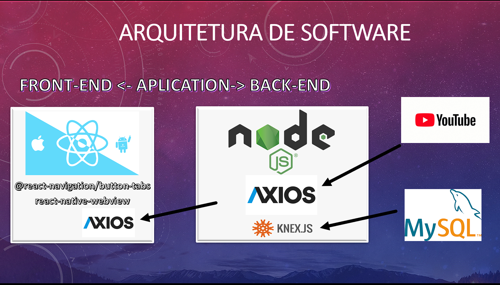

# DevFlix
App de streaming de vídeo estilo Netflix.

:dart:**Justificativa**

App desenvolvido com proposito de integrar API do Youtube em um app Expo e Native.

:white_check_mark: **Tecnologias**

- React Native
- JavaScript

:white_check_mark: **Freameworks:**

- Expo
- npm
- Axios

 :medal_sports:**Autores**
| Foto                                                                                                                             | Nome                      | GitHub                                   | Likedin                                                 | E-mail                    |
| -------------------------------------------------------------------------------------------------------------------------------- | ------------------------- | ---------------------------------------- | ------------------------------------------------------- | ------------------------- |
| | Eduardo Silveira Ramos | [EdLoth](https://github.com/EdLoth) | [Linkedin](https://www.linkedin.com/in/eduardo-ramos-31413b1a2/) | contatoeduardo.dev@gmail.com

:computer:**Arquitetura**

:clipboard:**Comandos**

* Instalar o Expo-cli

`npm install -g expo-cli`

* Inicializar uma aplicação

`expo init nome_projeto`

* Instalar dependências

`npm install`

* Start na aplicação

`npm start`
